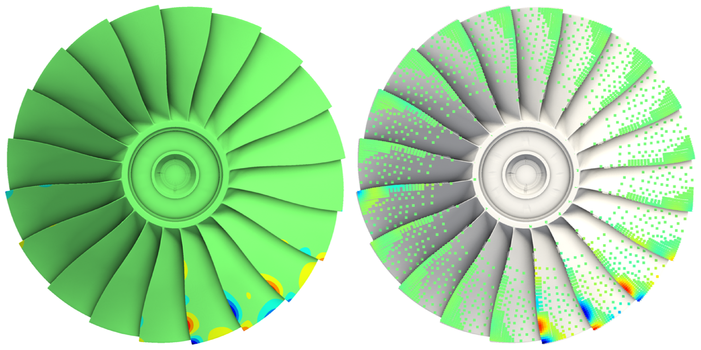

# Experimental Investigation of As-manufactured Modeling for Integrally Bladed Rotor Frequencies and Mode Shapes



*Full rotor mode 192: GMM prediction (left) versus mode from TWE (right).*

**[Download the paper (PDF)](https://github.com/akaszynski/turbo2026/releases/latest/download/turbo2026.pdf)** · [compressed](https://github.com/akaszynski/turbo2026/releases/latest/download/turbo2026_compressed.pdf)

LaTeX source for ASME Turbo Expo 2026 paper TURBO2026-179212.

**Authors:** Alex Kaszynski, Lucas Smith, Justin Warner, Jeffrey M. Brown

Contact lead author, Alex Kaszynski here via an issue or via his email (in the paper), for any questions regarding this research.

## Build

```bash
lualatex turbo2026.tex
bibtex turbo2026
lualatex turbo2026.tex
lualatex turbo2026.tex
```

## AI Notice

AI (LLMs) was not used to write or format the conference or journal paper. Anthropic's Claude was only used to help generate this repo by removing all references to private Python scripts and internal datasets to generate this paper. These changes were reviewed to ensure the original text and formatting of the paper remained intact; only comments and internal dataset references were removed.

## Copyright Notice

The United States Government retains, a nonexclusive, paid-up, irrevocable, worldwide license to publish or reproduce the published form of this work, or allow others to do so, for United States government purposes. This material is declared a work of the U.S. Government and is not subject to copyright protection in the United States. Approved for public release; distribution is unlimited.
